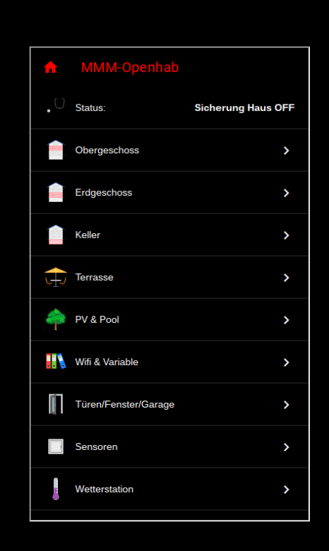

# MMM-Openhab

**Full control of your Openhab System using (touchscreen, mouse or touchpad (but that's only the beginning)**

## How it works

The module displays an Openhab sitemap on your Magic Mirror. If you have a mouse or touchscreen,
all values and switches (like lights, temperature and s.o.) can be changed.
The only thing you need is local access to your running Openhab System, no API key is required.

* No translation needed cause the sidemap from your own (in your native language written) is displayed

## Installation

* git clone this repository into the `~/MagicMirror/modules` directory.

* Annotated .css file are included to match Magic Mirror coloring text and header. Copy the contents of MMM-Openhab/Openhab2/html to the html directory of your openhab install configuration.

* Create a sitemap in your openhab installation. To match the magic mirror color scheme, add the following line to the beginning of your sitemap.

	sitemap MMM label="MMM-Openhab"
	{
    	        // Set for MMM-Openhab
		Webview url="/static/MMM-View.html"
		...
	}
	
An example of an Openhab2 (version 2.2) modified sitemap file using the html and css values for MagicMirror can be found in the repo. 

* add MMM-Openhab to your config file and tell it where to find your sitemap.

    {
        module: 'MMM-Openhab',
        position: 'bottom_right',                   // Best in left or right regions
        config: { 
		
		url: "http://YOUROPENHABINSTALL:8080/basicui/app?sitemap=MMM"   // url of your Openhab sitemap
	
        }
    },
    
* restart Magic Mirror
